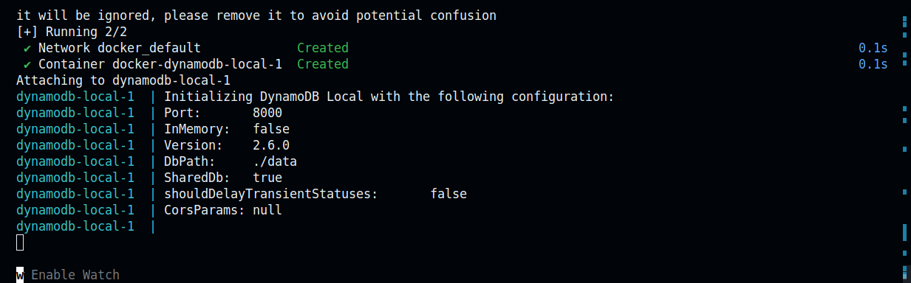

# DynamoDB Local

- [DynamoDB Local](https://docs.aws.amazon.com/amazondynamodb/latest/developerguide/DynamoDBLocal.DownloadingAndRunning.html)
- [NoSQL Workbench for DynamoDB](https://docs.aws.amazon.com/amazondynamodb/latest/developerguide/workbench.html)
- [Docker](https://docs.docker.com/get-started/get-docker/)
- [Docker Compose](https://docs.docker.com/compose/install/)

## Configure

*/path/to/faithcopilot-api/docker/docker-compose.yml*
```yaml
version: '3.8'
services:
 dynamodb-local:
   command: "-jar DynamoDBLocal.jar -sharedDb -dbPath ./data"
   image: "amazon/dynamodb-local:latest"
   ports:
     - "8000:8000"
   volumes:
     - "./dynamodb:/home/dynamodblocal/data"
   working_dir: /home/dynamodblocal
   environment:
     AWS_ACCESS_KEY_ID: '123XYZ'
     AWS_SECRET_ACCESS_KEY: '456ABC'
```

corresponds with:
- `AWS_ACCESS_KEY_ID`
- `AWS_SECRET_ACCESS_KEY`
- `AWS_DYNAMODB_ENDPOINT`

*/path/to/faithcopilot-api/wrangler.toml*
```sh
...
AWS_ACCESS_KEY_ID="123XYZ"
AWS_DYNAMODB_ENDPOINT="http://localhost:8000"
AWS_DYNAMODB_TARGET_VERSION="20120810"
AWS_DYNAMODB_TABLE="faithcopilot_dev"
...
```

*/path/to/faithcopilot-api/.dev.vars*
```sh
...
AWS_SECRET_ACCESS_KEY="456ABC"
...
```

## Run

```bash
sudo docker-compose -f /path/to/faithcopilot-api/docker/docker-compose.yml up
```



*when done (Ctrl+C)*
```bash
sudo docker-compose -f /path/to/faithcopilot-api/docker/docker-compose.yml down
```

## Initial Setup

via [NoSQL Workbench for DynamoDB](https://docs.aws.amazon.com/amazondynamodb/latest/developerguide/workbench.html)

### Add Connection

![[Pasted image 20250404204008.png]]

### Create Table

![[Pasted image 20250404203625.png]]
