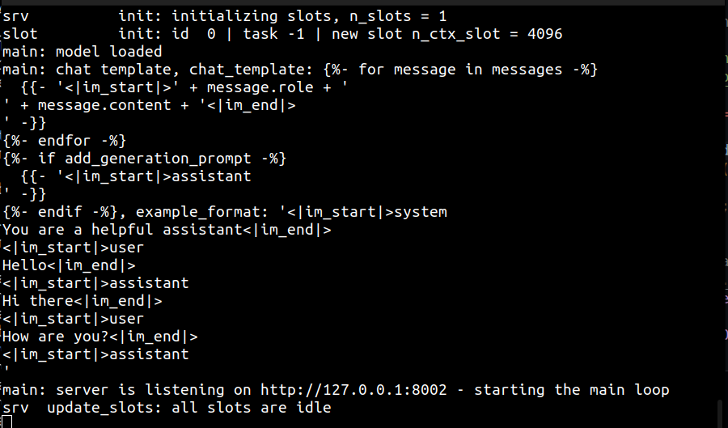
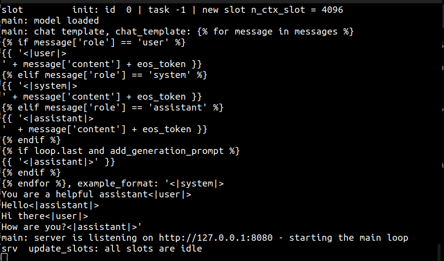

# Llama.cpp

- [llama.cpp](https://github.com/ggml-org/llama.cpp)

## Embeddings

### Download

[Search: Huggingface Models](https://huggingface.co/models?library=gguf&search=bge)

```sh
wget -P /path/to/llama.cpp/models https://huggingface.co/CompendiumLabs/bge-base-en-v1.5-gguf/resolve/main/bge-base-en-v1.5-f16.gguf
```

### Run

```sh
/path/to/llama.cpp/build/bin/llama-server -m /path/to/llama.cpp/models/bge-base-en-v1.5-f16.gguf --embedding --port 8002
```



## Test

```sh
curl -X POST \
  -H "Content-Type: application/json" \
  -d '{
      "content": [ "Your text here", "another test" ]
  }' \
  http://localhost:8002/embedding

#[{"index":0,"embedding":[[0.035710409283638,0.025016536936163902,0.0540543757379055,...]]},{"index":1,"embedding":[[0.012910409283638,0.042816536936163902,0.0226543757379055,...]]}]
```


## Chat Completions

### Download

- [Search: Huggingface Models](https://huggingface.co/models?library=gguf&search=TinyLlama)

```sh
wget -P /home/zmccoy/sandbox/faithcopilot-api-local/ https://huggingface.co/TheBloke/TinyLlama-1.1B-Chat-v1.0-GGUF/resolve/main/tinyllama-1.1b-chat-v1.0.Q5_K_M.gguf
```

### Run


```sh
/path/to/llama.cpp/build/bin/llama-server -m /path/to/llama.cpp/models/tinyllama-1.1b-chat-v1.0.Q5_K_M.gguf
```



### Test

```sh
curl -X POST \
  -H "Content-Type: application/json" \
  -d '{
    "model": "TinyLlama/TinyLlama-1.1B-Chat-v1.0",
    "messages": [
      {
        "role": "user",
        "content": "write a haiku about surfing"
      }
    ],
    "temperature": 0.7
  }' \
  http://localhost:8080/v1/chat/completions
```
